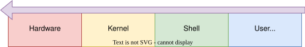

# BaOS (Bourne again Operating System)

**BaOS** is a simple **x86 32 bit operating system**. It includes a custom bootloader written in assembly and a C kernel that runs a basic shell for file and directory management.

The kernel implements **paging** with **identity mapping**, which allows it to map virtual memory directly to physical memory for simplicity while still enforcing access restrictions. Kernel memory is protected with user/supervisor bits, ensuring that programs running in **ring 3** cannot accidentally or maliciously overwrite critical kernel data. This creates a safe boundary between kernel space and user space, providing the foundation for running untrusted user programs.

> **Branch note:** This is the `thesis/paging` branch used for the comparative memory-management analysis in the master thesis. The sibling branch `thesis/segmentation` keeps the pure GDT segmentation variant for side-by-side comparison.

All drivers in BaOS are implemented as interrupt-based, ensuring efficient and responsive handling of hardware events without relying on polling. This approach allows the system to remain reactive even when multiple programs access different hardware resources simultaneously. A custom ATA PIO driver ensures the file system is **persistent across reboots**, rather than being stored only in memory.

A custom **ELF loader** manages loading user programs into memory and performs a lightweight context switch, mainly adjusting stack-related values to transfer control to user space. All communication between user programs and the kernel happens through a **syscall API**, keeping the kernel isolated from direct user-level memory access.

BaOS comes with a **custom C runtime**, including `crt0` and supporting runtime libraries. It provides most of the standard ANSI C functionality and parts of some POSIX headers, allowing programs to rely on familiar C constructs while using custom syscalls under the hood. The system currently includes a **shell**, a **text editor** called `filling`, a **calculator** called `calc` capable of evaluating numerical expressions as well as linear and general equations using the Newton-Raphson method.

Looking forward, one of the main goals is to eventually port a **C compiler** to BaOS once the runtime environment becomes mature enough, enabling full compilation of user programs directly on the system.

BaOS is also planned to evolve into a more fully-featured OS, including a **graphical user interface (GUI), sound support, multitasking**, and the ability to handle common file types such as images and audio. Additionally, a **TCP/IP stack** is planned to enable networking features such as sending and receiving emails, making HTTP requests, and other network communications. Based on this networking layer, a package manager will allow the BaOS community to share and distribute programs.

These improvements aim to make BaOS a versatile, minimal, and safe operating system capable of running multiple user programs concurrently with persistent storage and a rich set of multimedia, UI, and networking capabilities.

## General architecture 🏛️

BaOS is structured in a clear hierarchical architecture that separates hardware management from user interaction. At the lowest level is the hardware, including the CPU, memory, and I/O devices. The kernel sits directly on top of the hardware and is responsible for all low-level management, including device I/O and the file system. It exposes its functionality to higher-level components through a set of C functions, which serve as a stable API.

<div align="center">
    
</div>
</br>

The shell and user applications operate at the top of this hierarchy in **ring 3**, ensuring that they cannot access kernel memory or hardware directly. These programs use a custom **libc** runtime, which provides standard C functionality while translating requests into system calls that request services from the kernel. This layer allows user programs to perform operations such as reading and writing files, creating directories, or interacting with other system services, without breaking the separation between user space and kernel space. By keeping the shell and all user applications in ring 3, BaOS enforces security and stability while providing a flexible environment for program execution.

## Memory layout

BaOS memory use is documented in two phases: what the bootloader establishes before jumping to the kernel, and how the running kernel organizes memory afterward. **Phase 1 is identical on both thesis branches** (`thesis/paging` and `thesis/segmentation`). **Phase 2 reflects the branch’s memory-management model.**

### Phase 1 — Bootloader

Fixed physical addresses used in real mode and early protected mode ([`bootloader/boot.asm`](bootloader/boot.asm)):

| Region | Physical address | Purpose |
|---|---|---|
| Boot sector | `0x00007C00` | MBR code (`[ORG 0x7C00]`), real-mode stack at `SP=0x7C00` |
| Kernel load buffer | `0x00010000` | LBA 1+ sectors loaded to segment `0x1000:0x0000` |
| E820 map | `0x00008000` | BIOS memory map: count at `0x8000`, entries from `0x8004` |
| Protected-mode stack | `0x00090000` | Stack before far jump to kernel |
| Kernel entry | `0x00010000` | `jmp 0x08:0x10000` — start of linked kernel |

**Disk image layout** ([`Makefile`](Makefile)):

- `baos.img` sector 0 (LBA 0): bootloader (`boot.bin`)
- LBA 1+: kernel binary (`kernel.bin`, linked at `0x10000`)
- Programs and docs are injected later by `mkfs_inject.py` (filesystem on disk, not fixed RAM addresses)


### Phase 2 — After kernel init (paging branch)

Identity-mapped low memory plus a dedicated user region ([`kernel/paging/paging.c`](kernel/paging/paging.c), [`kernel/paging/paging.h`](kernel/paging/paging.h), [`kernel/link.ld`](kernel/link.ld), [`kernel/loader/user.ld`](kernel/loader/user.ld)):

| Region | Virtual = physical | Size / notes |
|---|---|---|
| Kernel image | `0x00010000` – `_end` | `.text`, `.data`, `.bss` per [`kernel/link.ld`](kernel/link.ld) |
| Page-table pool | `0x00080000` | 512 KiB (`.page_tables`, 128 × 4 KiB tables) |
| Kernel heap (`kmalloc`) | `_end` – `_end + 16 MiB` | Grows via `ensure_phys_range_mapped` |
| Low RAM identity map | `0x0` – 4 MiB (+ E820-driven regions) | Kernel/supervisor only; first 4 MiB respects E820 + VGA |
| User program pool | `0x02000000` – `0x02100000` | `USER_PHYS_BASE` + `USER_POOL_SIZE` (1 MiB); ELF linked at `0x02000000` |
| User stack | `0x020FF000` – `0x02100000` | Top 4 pages (`USER_STACK_PAGES`); grows down from `USER_STACK_TOP` |
| User heap (`malloc`) | After program `_end` up to `USER_STACK_BOTTOM` | Expanded on demand via `SYS_SET_USER_PAGES` |

User programs use **the same virtual and physical addresses** (identity mapping in the user pool). The kernel enforces isolation with `PAGE_USER` on user page mappings.

## Getting started 🥟

> **Note:** PC speaker (sound) is **only available when running locally**. To enable it, uncomment `QEMU_AUDIO_FLAGS` in the [`Makefile`](Makefile):
>
> ```makefile
> QEMU_AUDIO_FLAGS = \
> 	-audiodev pa,id=snd0 \
> 	-machine pcspk-audiodev=snd0 \
> 	-device intel-hda
> ```
>
> Set the audio backend for your system:
> - **Linux:** `pa` (PulseAudio) or `alsa`
> - **Windows:** `dsound`

---

### Running via Docker 🐳

The project can be run directly in Docker without installing all dependencies on your host.

1. **Build and run:**

```bash
docker compose up --build
```

2. **Access BaOS:**
- In your browser (recommended): [http://localhost:6080/?autoconnect=1&resize=scale](http://localhost:6080/?autoconnect=1&resize=scale)
- Or using a VNC client in your terminal (requires `vncviewer`):

```bash
vncviewer localhost:5900
```

3. **Reset the build volume** (stop the container first, then remove persisted data if needed):

```bash
docker compose down
docker volume rm baos-data
```

### Running locally 🖥️

If you prefer to build and run BaOS **directly on your host**, you need the following installed:

- **NASM**      – Netwide Assembler  
- **QEMU**      – Quick EMUlator  
- **Python 3**  – for websockify if using noVNC  
- **Make**      – GNU Build tool  
- **[elf-tools](https://github.com/lordmilko/i686-elf-tools/releases/tag/13.2.0)** – Cross compiler and linker (**IMPORTANT**: always use the GCC 13.2.0 release)  
- **mingw**     – only required on Windows for certain utilities like `dd`  

1. **Build the project:**

```bash
make
```

2. **Run the OS in QEMU:**

```bash
make run
```

> With local builds, uncomment `QEMU_AUDIO_FLAGS` in the Makefile and set the proper backend (e.g. `pa`/`alsa` on Linux, `dsound` on Windows) to hear PC speaker sounds from BaOS.

## Credits 🙏

- 🌐 <a href="https://www.flaticon.com/free-icons/xiao-long-bao" title="xiao long bao icons">Xiao long bao icons created by zero_wing - Flaticon</a>

_Happy coding!_ 🚀
